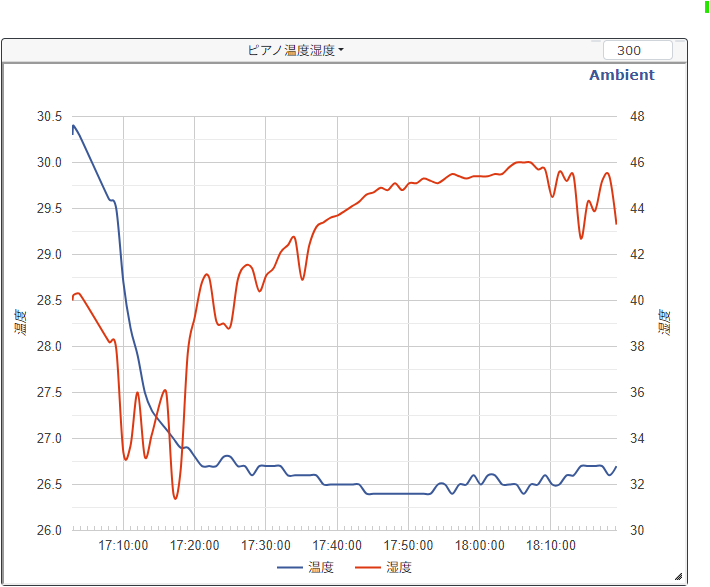
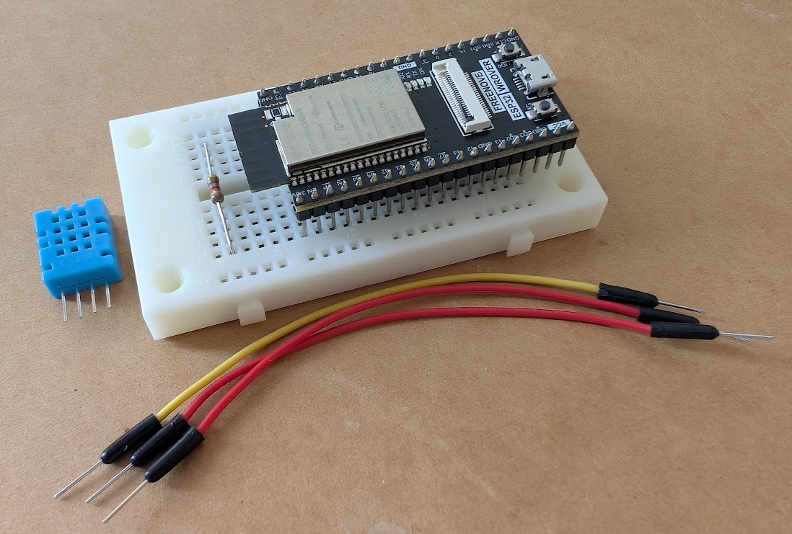
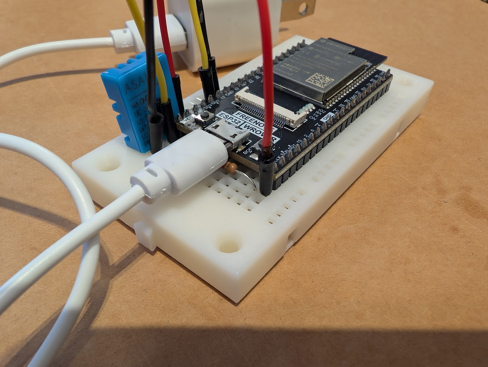
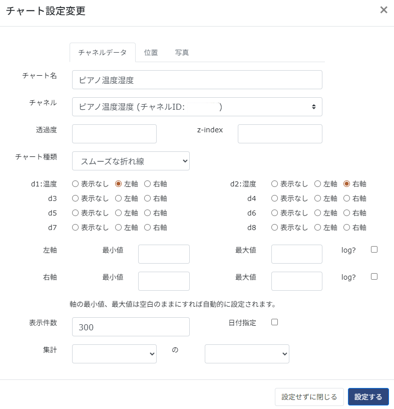

# ArduinoTemperatureHumiditySensor4Pianist
Temperature and Humidity Sensor for Piano conditioning by ESP32 Arduino and DHT11 sensor module.

ピアノの温度・湿度をスマホから確認できたらいいなあ....  
ということでインターネット経由で監視できるシステムをESP32マイコンボードとAmbient IoTデータ可視化サービス（無料）を利用して開発しました。

## 表示例
IoTデータ可視化サービス[Ambient](https://ambidata.io/)を利用させていただいております。ありがとうございます。

## 部品
- マイコン Freenove ESP32 WROVER (カメラモジュール不要)   (1,000～3,000円くらい。WiFiモジュールがついていれば一番安いものでOK)
- 温度湿度センサー DHT11 Temperature and Humidity Sensor module.  (550円くらい) [秋月電子通商のDHT11のページ](https://akizukidenshi.com/catalog/g/g107003/)
- 抵抗器 electrical resistor 4.7KΩ x 1  (5円くらい) 秋葉原の[マルツ](https://www.marutsu.co.jp/pc/static/shop/akihabara?srsltid=AfmBOooxmcF6RHUCmPnxy95wnrMOSUgJfuMlz02e7loPambjFAETOjdl)さんでバラ売りしています。
- ブレッドボード Breadboard x 1 (400円くらい)
- ワイヤリングケーブル 3本 wire cables x 3.
- USB電源アダプタ（不要になった古いスマホ用の電源アダプタでOK）

**部品の一覧**

## 組み立て
- ブレッドボードにESP32ボードを差し込みます。
- DHT11は網目のような穴の開いている面が見えるように持ったときに、左側からPIN番号1，2，3，4です。
  - 1: VCC(+5V)
  - 2: Serial Data
  - 3: NC
  - 4: GND
  - 詳しくは[DHT11データシート](DHT11_DATASHEET_20180119.pdf)をご覧ください。
- DHT11のVCCピン(1番ピン)がESP32のVCCと書いてあるピン(1番ピン)に繋がるようにブレッドボードに差し込みます。
- DHT11のGNDピン(4番ピン)とESP32のGNDと書いてあるピン(GNDならどこでもよい)に繋がるようにジャンパ線で繋ぎます。
- DHT11のDataピン(2番ピン)とESP32の13番ピンが繋がるようにジャンパ線で繋ぎます。
- DHT11のDataピン(2番ピン)に抵抗器(4.7kΩ)を繋ぎ、抵抗器の反対側をESP32のVCCと書いてあるピンに繋ぎます。（これを「プルアップ抵抗」と言います）
- DHT11の3番ピンには何も繋ぎません。
- 完成したら、USB-microBケーブル（電源用USBケーブルは使えません。必ずデータ用USBケーブルを使用してください）をESP32ボードに繋ぎ、PCのUSBポートに繋ぎます。ESP32ボードの緑色のランプが点灯します。

**完成図**
ブレッドボードが小さすぎてセンサーが傾いてしまったのでもう少し大きいボードのほうがよいです。

## 開発環境

#### Arduino IDE 2.3.8
- [Arduino IDE](https://www.arduino.cc/en/software/)

**Libraries**
- Arduino IDEのツールメニューから「ライブラリを管理...」を選択してインストールできます。以下の2つをインストールします。
- [Ambient ESP32 ESP8266 lib by Ambient.](https://github.com/AmbientDataInc/Ambient_ESP8266_lib)
- [DHT sensor library by Adafruit 1.4.7](https://github.com/adafruit/DHT-sensor-library)

## Ambient IoT可視化サイトへの登録（無料）

- IoTデータ可視化サービス[Ambient](https://ambidata.io/)に会員登録し、チャンネルを一つ新規に作成します。
- チャンネルID,チャンネルキーをメモしておきます。（あとでソースコードに埋め込みます）
- グラフを設定し、データ1を温度、データ2を湿度に設定します。  
  
  
## ソースコードとコンパイル

- 本リポジトリにある[main.c](src/main.c)をArduino IDEのエディタに貼り付けて、以下の値をあなたの環境に合わせて書き換えた後、コンパイルボタンでコンパイルします。
  - WiFiのSSIDとパスワード(2.4GHzしか使えません)
  - Ambientに登録（無料）して管理画面で設定した、チャンネルIDとチャンネルキー
- ESP32ボードに書き込むときは、ESP32ボードのBOOTボタンを押したままArduino IDEの書き込みボタンを押して書き込み完了したらボタンを離します。
- 書き込み成功したらESP32ボードのRESETボタンを押すとプログラムがスタートします。
- Arduino IDEのメニューからツール＞シリアルモニタを開くと動作状況が確認できます。無事にWiFiに接続され、データが取得できると温度、湿度が1分おきにシリアルモニタに表示されます。
- 正しく動作していれば、Ambientのあなたのページに温度、湿度のグラフが表示されます。
- 完成したら、USBケーブルをPCから外し、USBのACアダプタに繋ぎ変えます。電源をつなぐだけで自動的にスタートし、温度・湿度を測定してAmbientにデータを送信します。

## 謝辞
ソースコードは[こちらのサイト](https://qiita.com/denden888/items/101bd1ee937f85f355ea)を参考にさせていただきました。ありがとうございます。
