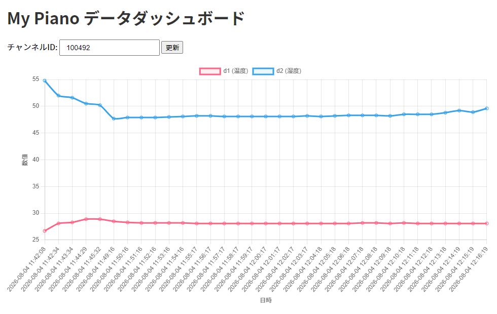

# Ambient互換のWebサーバをミニマム構成で構築する方法

ambient.ioに依存しているのはあとあと困りそうでしたので、自分のサーバを立てて、そこでAmbient.io互換のWebサーバを立てることにしました。

OCI(Oracle Cloud Infrastructure)の永久無料サーバで構築できます。



## 簡単な手順

### OCIにUbuntu24.04.LTSサーバを立てます。

このとき、注意点としては、OCIのUbuntu24.04サーバは、デフォルトでiptablesが動作しており、ssh(TCP/22)以外は全ポートクローズの設定になっています。  
そのため、iptablesでポートTCP/8080の解放の設定が必要です。  
```shell
# TCP/8080へ外部からの接続を許可
sudo iptables -I INPUT 1 -p tcp --dport 8080 -j ACCEPT

# 現在の iptables ルールを保存
sudo apt-get install -y iptables-persistent
sudo netfilter-persistent save
```

その後に、OCIのVNICのセキュリティ設定で、ポートTCP/8080を開放する設定も必要です。  


### Python3とsqlite3をインストール

```shell
sudo apt update
sudo apt install -y python3-pip python3-venv

mkdir ~/ambient-compat && cd ~/ambient-compat
python3 -m venv venv
source venv/bin/activate
pip install fastapi uvicorn sqlite3

```

`main.py`を上記で作成した`~/ambient-compat/`ディレクトリに置きます。

### 起動スクリプトの作成と登録

`ambient.service` を `/etc/systemd/system/ambient.service`において  
```shell
sudo systemctl daemon-reload
sudo systemctl enable ambient.service
```
とすると起動スクリプトが登録されます。

```shell
sudo systemctl start ambient.service    # 起動
sudo systemctl status ambient.service   # 動作確認
```

でポート8080でWebサーバが起動します。

確認(OCIのUbuntuサーバ上で)
```shell
curl http://localhost:8080/
```

これで動作していれば、手元のPCのブラウザで以下のようにしてAmbient互換サーバが起動します。  
http://your.ip.address:8080/

### ESP32 (Arduino IDE) 側の修正

Arduino IDEでlibraryフォルダを探し、Ambient.cを開き、サーバのアドレス(ambient.io)を上記のIPアドレスに置換します。ポートを80から8080に変更します。  
Arduino IDEで再コンパイルをすれば、自動的にlibraryのソースコードも再コンパイルされます。  

